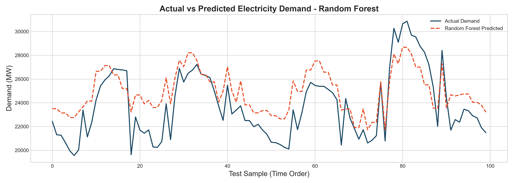
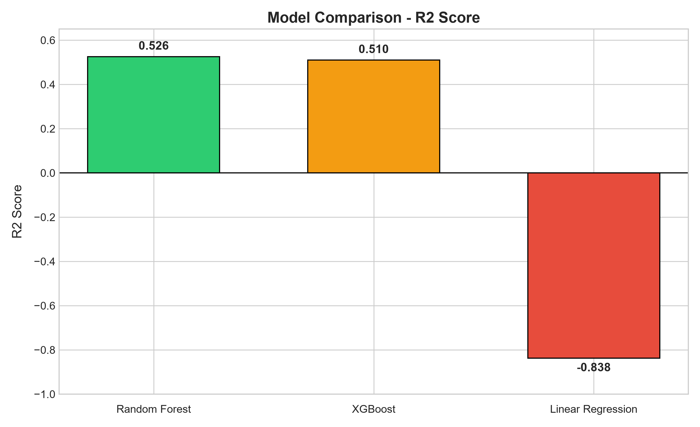

# UK Load Forecasting

## Overview
Machine learning project forecasting UK electricity system demand using half-hourly settlement data from National Grid ESO (NESO). Builds on exploratory findings from the companion project, [uk-electricity-demand-analysis](https://github.com/UDAY-KIRAN-IN/uk-electricity-demand-analysis), by turning descriptive analysis into predictive modeling.

## Dataset
- Source: National Grid ESO (NESO) Historic Demand Data
- ~9,214 half-hourly records (Jan–Jul 2026)
- Key columns: SETTLEMENT_DATE, SETTLEMENT_PERIOD, TSD (Total System Demand)

## Methodology
- Engineered time-based features: hour of day, day of week, month, weekend flag
- Chronological (time-based) train/test split — 80% train, 20% test — to simulate real-world forecasting where only past data is available
- Trained and compared three models: Linear Regression, Random Forest, XGBoost
- Evaluated using MAE, RMSE, and R² Score

## Results

| Model | MAE (MW) | RMSE (MW) | R² Score |
|---|---|---|---|
| **Random Forest** | **2,083.78** | **2,649.21** | **0.5217** |
| XGBoost | 2,115.22 | 2,660.98 | 0.5174 |
| Linear Regression | 4,272.45 | 5,172.36 | -0.8234 |

Random Forest was the best-performing model, capturing ~52% of the variance in electricity demand. Linear Regression underperformed a naive baseline due to its inability to model the cyclical nature of daily demand patterns.




## Tools Used
Python, Pandas, NumPy, Matplotlib, Scikit-learn, XGBoost, Jupyter Notebook

## How to Run
1. Clone this repo
2. Install dependencies: `pip install -r requirements.txt`
3. Open `notebooks/01_load_forecasting.ipynb` in Jupyter/VS Code
4. Run all cells

## Project Structure
```
uk-load-forecasting/
├── data/              # Raw dataset (reused from Project 1)
├── notebooks/         # Analysis and modeling notebook
├── outputs/           # Saved chart images
├── src/               # (Reserved for future reusable scripts)
├── README.md
└── requirements.txt
```